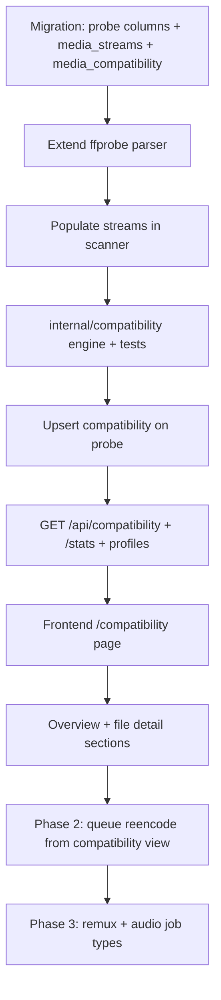

# Reclaim — Direct-Play Compatibility Plan

**Status:** Phase 1 complete — PR1 (probe + schema), PR2 (compatibility engine), PR3 (API + store), and PR4 (read-only UI) are **implemented, uncommitted** (see §17 for exact scope/deviations). **Phase 2 (queue overlapping HEVC re-encode fixes) is also implemented, uncommitted** — see §3, §8, §10, §17 item 5 for scope. Nothing has landed on `main` yet.

**Naming note:** the engine/package/route were originally sketched below as `compat` (e.g. `internal/compat`, `/api/compat`, `web/components/compat/`). Renamed to the full word `compatibility` throughout during PR4 — `compat` reads as "compact" at a glance, and the shorter name scoped the package too tightly to direct-play specifically; "compatibility" leaves room for other future checks (e.g. corruption/health checks) to live in the same package without an awkward name. Every code reference below (`internal/compat`, `/api/compat`, `CompatRow`, etc.) should be read as `compatibility`/`Compatibility*` — left as originally written in this doc's history rather than retroactively edited everywhere, except where noted.
**Companion to:** [`RECLAIM SPEC.md`](RECLAIM%20SPEC.md), [`RECLAIM PLAN.md`](RECLAIM%20PLAN.md), [`API.md`](API.md).

A phased plan to add **predicted direct-play compatibility** to Reclaim as a parallel mode alongside the existing HEVC savings workflow. Grounded in the current architecture: scanner → `ffprobe` → SQLite → ranked lists → manual queue → overnight worker.

---

## 1. Goals & non-goals

### Goals

- Help users find files that **will likely force Plex/Jellyfin/Emby to transcode** on a chosen client profile.
- Explain **why** each file fails (video codec, audio, container, HDR, subs, etc.).
- Rank offenders for triage across 20k+ files using the same patterns as candidates (server pagination, virtualization, manual queue).
- Eventually queue **fixes** through the existing job infrastructure (verify → atomic swap).

### Non-goals (explicit)

- **No Plex/Jellyfin API integration** — stays filesystem-native per spec §2 principle 3.
- **No playback telemetry** — we predict from probe data, not actual transcode logs.
- **No auto-queue** — manual-first per spec §2 principle 1.
- **No GPU/NVENC in v1** — CPU `libx265` only, same as today.
- **No claim of ground truth** — UI labels everything **"predicted"**, like `predicted_savings_bytes`.

### Product framing

Reclaim becomes: **"Make my library better"** with two lenses:

| Lens | Question | Primary score |
|------|----------|---------------|
| **Savings** (existing) | How much space would HEVC reclaim? | `predicted_savings_bytes` |
| **Compatibility** (new) | Will this direct-play on my client? | `compatibility_risk_score` |

Keep the Reclaim brand; compatibility is a major feature, not a rebrand.

---

## 2. Design principles check

Every phase must pass the existing spec gates:

| Principle | Compatibility implication |
|-----------|-------------------------|
| Manual-first | Rank + explain; user selects what to fix |
| Filesystem truth | Rules run on probe data only |
| Non-destructive | Reuse verify + atomic swap from worker |
| Window controls *when*, not *what* | Same encode window for all job types |
| Honest estimates | "Predicted direct play" badges, reason codes |

---

## 3. Phased rollout

**Priority:** the driving goal is visibility — "what's direct-play compatible
vs. what's not" — so **Phase 1 is the priority target**, not a formality on
the way to Phases 2–4. Phases 2–4 remain the intended long-term direction
(confirmed: full plan, not audit-only), but should be picked up only after
Phase 1 has shipped and been used against a real library for a while.
Don't let queue/worker design considerations from Phases 2–3 gate or slow
down Phase 1 scope.

### Phase 1 — Audit & rank (no new worker paths)

**Ship:** compatibility scoring, client profiles, new UI tab, overview stats, file detail reasons.
**Queue:** disabled or limited to "also a savings candidate" files only.

**Why first:** Validates rules against real libraries, zero risk to file safety, reuses 90% of read path.

### Phase 2 — Queue overlapping fixes

**✅ Landed, uncommitted.** **Ship:** queue from compatibility view when the recommended fix is an existing **HEVC re-encode** (same `POST /api/jobs` + `libx265` worker).
**UI:** "Recommended action: Re-encode to HEVC" with link to savings rationale.

**Why second:** No worker changes; H.264 → HEVC often helps both savings and compatibility on some clients.

**Deviations worth knowing:**

- `POST /api/jobs` gained `source`/`client_profile` fields (Option A from
  §8) rather than a new endpoint. `source: "compatibility"` swaps the
  per-file eligibility check from the savings rule ("not already HEVC") to
  a server-side lookup of the file's stored `media_compatibility` verdict
  for `client_profile`, requiring `recommended_action == "reencode_hevc"` —
  new store method `Media.CompatibilityVerdict`. This deliberately allows
  queuing a file that's *already* HEVC if a verdict recommends
  `reencode_hevc` for it (e.g. wrong bit depth for a future profile), which
  the savings rule alone would skip. See `internal/api/jobs.go`.
- UI parity was scoped to fully mirror the existing HEVC-savings queue UX
  (Library page's `MediaFlatRow`/`gateSelection` pattern), not just the
  file-detail button originally sketched in §10: the `/compatibility` list
  gained a checkbox column (gated on `recommended_action === "reencode_hevc"`,
  same `queueBlockReason`-style tooltip pattern) plus the shared
  `QueueSelectionBar`/`QueueConfirmDialog`, and the file-detail Predicted
  Playback section gained a "Queue re-encode" button next to the active
  profile's recommended action (shown only when queueable and the file has
  no blocking job already, regardless of `is_already_hevc`).
- Selections on `/compatibility` are cleared on client-profile switch —
  `recommended_action` is per-profile, so a selection made under one
  profile's verdicts isn't valid under another's.

### Phase 3 — Remux & audio-only jobs

**Ship:** new job types (`remux`, `audio_transcode`) in worker; action-specific verification.
**UI:** per-file recommended action with profile picker.

**Why last:** Biggest engineering lift; needs new ffmpeg wrappers and verification rules.

### Phase 4 (optional) — Learned compatibility

Track completed jobs + user overrides to tune rules. Lower priority than Phases 1–3.

---

## 4. Client profiles

### Concept

A **client profile** is a named ruleset representing a playback device, not an encode profile (CRF/preset).

```go
// internal/compatibility/profile.go
type ClientProfile struct {
    ID          string // "apple_tv_4k", "nvidia_shield", "web_browser"
    Name        string // "Apple TV 4K"
    Description string
    Rules       Rules  // versioned rule bundle
}

// Rules is the versioned bundle of allow/deny checks for one client.
// Defined in rules.go; constructed inline per profile in profile.go (see §6).
type Rules struct {
    VideoCodecs         []string
    MaxHEVCBitDepth     int
    Containers          []string
    ContainersAdvisory  []string // lower RiskScore weight — server-profile-dependent, not a hardware ceiling; see §6
    AudioCodecs         []string // Hard: no known passthrough path
    AudioCodecsAdvisory []string // lower RiskScore weight — passthrough-dependent, see §6
    MaxAudioChannels    int
    // ...
}
```

### v1 built-in profiles (ship all 4 — decided §15 Q7)

| ID | Name | Rationale |
|----|------|-----------|
| `apple_tv_4k` | Apple TV 4K | Models modern-hardware capability (HEVC 10-bit HDR, E-AC3/Atmos) — see §6 sourcing: **MKV+HEVC-over-HTTP direct play is not a reliable Hard fact even on current PMS/tvOS** (contradicts an earlier draft of this plan; corrected after research), so MKV is Advisory-severity here, not Hard like MP4/MOV/M4V |
| `nvidia_shield` | NVIDIA Shield | Broadest video codec support incl. hardware MPEG-2 decode, no AV1 on any Shield model; audio codec rules are Advisory-severity because DTS-HD/TrueHD/DTS:X are genuine HDMI bitstream **passthrough** per NVIDIA's own spec (§6) — unlike Apple TV (see below), which has no passthrough at all |
| `plex_web` | Plex Web / Browser | Conservative; H.264 + AAC in MP4, 8-bit, ≤6 audio channels; no audio passthrough path (browser tab, not a home theater device), so audio-channel and codec rules stay Hard-severity here unlike the other profiles. Confirmed: **HEVC does not direct-play here even on browsers with hardware HEVC decode** (Chrome 107+, Edge) — Plex Media Server's *default* browser client profile doesn't expose that capability; users have to hand-edit server-side XML profiles to change it, which Reclaim can't detect. See §6 sourcing. |
| `generic_hevc` | Generic HEVC client | Intentionally **synthetic**, not a single certified device — models **Kodi and Jellyfin Media Player (native desktop) specifically**, the two clients with the cleanest, most uniform HEVC 8/10-bit + MKV support in Jellyfin's own codec matrix. Deliberately does **not** claim to cover Android TV (10-bit is device-dependent), Roku (HEVC only on 4K devices), or the Android mobile client (currently has a broken HEVC capability report) — see §6 sourcing for the variance this profile explicitly excludes. Useful as a "loose" reference point distinct from the stricter named profiles; label copy should say "generic" explicitly so users don't mistake it for a specific device. |

Profiles are **static Go structs** in v1 (like `seedHEVCRatios`). User-selectable default stored in settings (see §10). Custom profiles deferred.

### Settings integration

**Implemented** (ahead of the rest of Phase 1 — see §17 PR1): persisted in the
`settings` DB row (migration `00010_default_client_profile.sql`), **not**
`config.Live` — `Live` is in-memory/env-reseeded on every restart, which
would silently lose the user's choice. `store.Settings.DefaultClientProfile`
/ `SetDefaultClientProfile` back `GET`/`PUT /api/settings`:

```json
{
  "default_client_profile": "apple_tv_4k"
}
```

`PUT` validates against the known profile IDs before writing. **✅ Landed
(PR3):** `internal/api/settings.go`'s `validClientProfiles` now derives from
`internal/compatibility.BuiltinProfiles()` (built once at package init) instead of a
hardcoded set, so there's a single source of truth.

Compatibility queries accept `?client_profile=`; default from settings when omitted.

---

## 5. Probe extensions

Current `ffprobe.Result` is thin — first video stream, first audio stream only (`internal/ffprobe/ffprobe.go`).

### New fields to extract (migration `00009_compatibility_probe.sql` — **implemented**, see §17 PR1)

**On `media_files` (denormalized primary streams — keep fast list queries):**

| Column | Source | Used for |
|--------|--------|----------|
| `pixel_format` | video `pix_fmt` | 10-bit detection (`yuv420p10le`) |
| `video_bit_depth` | derived from pix_fmt | 8 vs 10 |
| `color_transfer` | video `color_transfer` | HDR (`smpte2084`, `arib-std-b67`) |
| `color_primaries` | video `color_primaries` | HDR / wide gamut |
| `audio_sample_rate` | audio `sample_rate` | edge cases |
| `subtitle_codec` | first subtitle stream | PGS (`hdmv_pgs_subtitle`) vs text |

**New table `media_streams` (all streams — needed for multi-audio, PGS, Atmos):**

```sql
CREATE TABLE media_streams (
    id INTEGER PRIMARY KEY AUTOINCREMENT,
    media_file_id INTEGER NOT NULL REFERENCES media_files(id) ON DELETE CASCADE,
    stream_index INTEGER NOT NULL,
    codec_type TEXT NOT NULL,       -- video | audio | subtitle
    codec_name TEXT,
    profile TEXT,
    channels INTEGER,
    language TEXT,
    disposition_default INTEGER,
    extra_json TEXT,                -- pix_fmt, bit_rate, tags — rare fields
    UNIQUE(media_file_id, stream_index)
);
CREATE INDEX idx_media_streams_file ON media_streams(media_file_id);
```

Populate on every probe in `scanner.probeAndStore`. List endpoints keep using denormalized columns; file detail + compatibility engine read `media_streams` when needed.

### Backfill

**Confirmed: this must be a genuine full re-probe, not the normal startup scan.**
`Scanner.Scan` (`internal/scanner/scanner.go`) skips re-running `ffprobe` on
any file whose `(size, mtime)` still matches the stored row:

```go
// scanner.go — the skip that makes normal scans cheap
if !force && rec != nil && rec.SizeBytes == size && rec.Mtime == mtime {
    // already indexed, unchanged on disk — no re-probe
    continue
}
```

The regular startup scan and scheduled rescans call `Scan(ctx, trigger, force=false)`
— so on a normal reboot, every file already in the DB will be skipped, and
`pixel_format` / `media_streams` / etc. will stay `NULL` forever for existing
files. Only `force=true` (`POST /api/scan/full`, wired through
`handleFullScan` → `triggerScan(c, true)`) bypasses the equality check and
re-probes everything. So the migration step must explicitly call the full-scan
path — a plain restart is not sufficient, and doing nothing here silently
leaves the whole existing library without compatibility data.

On migration + boot: trigger this **full rescan** (or lazy: score as `null`
until reprobed). Show banner: "Compatibility data requires a library rescan."

**This rescan is the real cost of Phase 1, not the compatibility evaluation itself**
(see §6's "~4x probe cost" note, which only covers the cheap in-memory rule
eval). Re-running `ffprobe` against every file in a 20k-file library is a
full scan-duration operation — this is a real, measurable amount of `ffprobe`
process-spawn overhead the codebase doesn't otherwise pay after initial
indexing.

**Rough data point (recalled, not precisely measured): a full rescan of the
user's own library previously took on the order of ~10+ minutes.** That's
long enough that a static "requires a rescan" banner with no feedback would
read as broken or hung. **Decided: use a progress indicator, not a static
banner.** No new infrastructure needed — `Scanner` already broadcasts
`scan_progress` over the WS hub (`internal/scanner/scanner.go`), and the
frontend already consumes it via the existing `['scan_progress']` query-cache
pattern wired up for the manual "Scan" button on `web/app/(app)/page.tsx`.
The compatibility backfill banner should trigger `POST /api/scan/full` and render
using that same existing scan-progress UI, not build a new one.

**Correction (verified against the code, not just recalled):** the banner
must read `files_processed` (or `files_added + files_updated`), **not**
`files_scanned` — on a `force=true` full rescan, `files_scanned` only counts
files *skipped* because they were unchanged, which stays near-zero for a true
full rescan; nearly all work lands in `files_updated`/`files_added` instead.
`web/components/app-shell/use-shell-data.ts` already reads `files_processed`
for the existing "Scan now" banner, so the compatibility banner should reuse that
field, not `files_scanned` as an earlier draft of this doc assumed.

**Also verified:** there is currently no `scanFull()` call in `web/lib/api.ts`
— the frontend only ever calls `POST /api/scan` (incremental). Wiring the
compatibility backfill banner to `POST /api/scan/full` requires adding that client
method; it doesn't exist yet to reuse.

Before Phase 1 ships: get an actual timed measurement (not just recollection)
at real library size, mainly to set expectations in the banner copy (e.g.
"this may take several minutes") — the mechanism itself is already decided.

---

## 6. Compatibility rules engine

**✅ Landed (PR2), uncommitted.** New package: `internal/compatibility/`
(renamed from the `internal/compat/` sketched below during PR4 — see the
naming note at the top of this doc; file names/contents are otherwise as
originally landed).

```
internal/compatibility/
  profile.go      # built-in ClientProfile definitions
  rules.go        # Rule types + evaluator
  score.go        # risk score + reason codes
  score_test.go   # table-driven fixtures
  actions.go      # recommended RemediationAction per failure
```

**Deviations from this section worth knowing before touching the code:**

- `Evaluate(input EvalInput, profile ClientProfile) Verdict` takes an
  `EvalInput`/`StreamInfo` pair *owned by this package*, not `ffprobe.Result`
  or `store.MediaStream` directly — this package imports neither `ffprobe`
  nor `store` (store depends on this package for `UpsertCompatibility`, so
  the reverse import would cycle). Callers (currently only the scanner, via
  `compatibilityEvalInputFromProbe`) map their own types in.
- Reason codes are **generated dynamically**, not a fixed enum: e.g.
  `"video_codec_mpeg2video"`, `"audio_dts-hd"`, `"container_mkv"`,
  `"hevc_10bit"`, `"audio_channels_exceeded"`, `"subtitle_pgs"`. The `dts`
  vs `dts-hd` vs `dtsx` distinction is derived from ffprobe's `profile`
  string (`audioCodecKey` in `score.go`), since ffprobe reports all three as
  `codec_name = "dts"`.
- Container matching normalizes ffprobe's raw `format_name` (e.g.
  `"mov,mp4,m4a,3gp,3g2,mj2"`, `"matroska,webm"`) through a small
  `containerFamilies` map in `score.go`, **not** the file extension — ffmpeg's
  demuxer names conflate MP4/MOV/M4V (and MKV/WebM) into one string, so
  membership is a set-intersection check against each profile's
  `Containers`/`ContainersAdvisory`, not an exact match. (Decided explicitly
  over extension-based detection when this was built.)
- `RiskScore` weights (`weight()` in `score.go`) are this package's own
  judgment call, not pinned by this doc — the doc only fixes the qualitative
  ordering (Hard > Advisory within a category). Current weights: video codec
  45, HEVC bit-depth 40, subtitle PGS 40, container Hard 35/Advisory 12,
  audio Hard 30/Advisory 10, channel-count-exceeded 25.
- `RecommendedAction` priority when multiple reason categories fire on the
  same file: **video > subtitle > container > audio** (`actions.go`).
  Advisory-only reasons still drive a recommendation (RiskScore, not the
  action, is where Hard/Advisory severity shows up) — e.g. an
  advisory-only DTS-HD+MKV file on Apple TV still recommends `remux` (its
  highest-priority present category), not `none`.
- `recommendedAction` downgrades `video_codec_unsupported`/`hevc_*` failures
  to `manual` instead of `reencode_hevc` when the target profile doesn't
  support HEVC at all (e.g. `plex_web`) — re-encoding to HEVC wouldn't fix
  compatibility there, and Reclaim's worker has no other video-target job
  type.
- The subtitle PGS check is a **blanket rule in `score.go`**, not part of
  `Rules` — it's profile-independent per this section's own reasoning, so it
  isn't a per-profile knob. It scans every subtitle stream, not just the
  first, matching the reason `media_streams` exists at all.
- `generic_hevc`'s exact `Rules` struct isn't given verbatim earlier in this
  section (unlike the other three) — it was synthesized in `profile.go` from
  this section's descriptive table row + §6 sourcing paragraph: `VideoCodecs:
  {"h264","hevc"}`, `MaxHEVCBitDepth: 10`, `Containers: {"mp4","mov","m4v","mkv"}`
  (no Advisory tier), `AudioCodecs: {"aac","ac3","eac3","dts","truehd","flac","mp3","pcm"}`
  (no Advisory tier — Kodi/JMP have no passthrough-dependent hedge the way
  Apple TV/Shield do), `MaxAudioChannels: 8`.
- 12 table-driven cases in `score_test.go`, each tied to a specific citation
  in this section (Apple TV MKV/DTS-HD advisory-not-hard, Shield's real
  MPEG-2/TrueHD passthrough, Plex Web's HEVC gap, generic_hevc's clean MKV
  support, PGS burn-in, multi-subtitle-track PGS detection).

### Evaluation model

```go
type Verdict struct {
    DirectPlayPredicted bool
    RiskScore           int      // 0 = likely direct play, 100 = certain transcode
    Reasons             []Reason // ordered, human-readable codes
    RecommendedAction   Action   // none | reencode_hevc | remux | audio_transcode | manual
}

type Reason struct {
    Code     string   // "audio_dts", "container_mkv", "hevc_10bit"
    Severity Severity // Hard | Advisory — see below
    Stream   *int     // stream index when relevant
    Message  string   // "DTS-HD MA 7.1 audio (stream 1)"
}

// Severity reflects confidence, not just impact. Hard reasons are client
// hardware ceilings (stable, unaffected by user settings). Advisory reasons
// depend on things Reclaim can't probe (server version, AVR passthrough,
// user toggles) — see "Caveat" below. Advisory reasons contribute less to
// RiskScore and get hedged copy in the UI.
type Severity int

const (
    Hard     Severity = iota // video codec, container/codec pairing, subtitles
    Advisory                 // audio codec/channel count (passthrough-dependent)
)
```

**`RiskScore`:** sum of weighted reason severities (advisory reasons weighted lower than hard reasons — see §6 audio caveat), clamped 0–100. Higher = worse. Enables `sort=risk_desc` with keyset pagination mirroring savings.

### v1 rule categories (per profile)

**Video** — high confidence; these drive real video transcodes, no downstream device can rescue them

- Codec not in allowlist (e.g. VC-1, MPEG-2, AV1 on older Apple TV)
- HEVC profile level too high
- 10-bit HEVC when client wants 8-bit Main
- Resolution over client cap (e.g. 8K)
- Bitrate over soft cap (optional, profile-specific)

**Container** — high confidence, but codec-dependent, not blanket "MKV bad"

- Codec/container pairing violated for that client (e.g. Jellyfin: HEVC direct-plays **only** in MP4/M4V/MOV on many clients — MKV+HEVC forces a remux even though the codec itself is fine)
- **Corrected after research (see §6 sourcing):** Plex's tvOS HEVC-over-MKV support was assumed above to work reliably on "current PMS + tvOS 15+." That is **not** supported by current evidence — reproducible reports as recent as Nov 2025 (PMS 1.42+, tvOS 17–18) show the *default* tvOS client profile still rejects `hevc`+`mkv`+`http` outright, requiring a hand-installed custom server-side XML profile, the same mechanism `plex_web` needs for HEVC. `apple_tv_4k` therefore treats MKV as **Advisory**, not Hard, while MP4/MOV/M4V stay Hard.

**Audio** — ⚠️ **low confidence by design; treat as advisory, not a hard "will transcode" verdict**

Real-world testing surfaced that DTS/DTS-HD MA/TrueHD/Atmos frequently **do** direct-play on Apple TV and Nvidia Shield, avoiding a full audio transcode — but **the mechanism differs by device, and the plan previously conflated the two** (corrected after research, see §6 sourcing):
- **NVIDIA Shield** performs genuine HDMI **bitstream passthrough** for Dolby TrueHD/DTS-HD/DTS:X — confirmed by NVIDIA's own spec page ("pass-through"). Whether it reaches the listener intact still depends on the downstream AVR/soundbar, which ffprobe cannot see.
- **Apple TV 4K has no bitstream passthrough at all**, for any codec (confirmed via Apple's own support docs). It always decodes internally to LPCM (or its own Dolby MAT re-encode for E-AC3/Atmos sources specifically); DTS/TrueHD/DTS:X lose their spatial metadata in that internal decode. So "requires a passthrough-capable receiver" is the wrong framing for Apple TV — the correct hedge is "Apple TV likely accepts this via Direct Play and decodes it internally, but loses lossless/spatial audio metadata in the process," and whether PMS's Apple TV profile even grants Direct Play to DTS/TrueHD in the first place is **unconfirmed from an authoritative source** (no current dump of the real default `tvOS.xml` audio allowlist was found — only community reconstructions, none of which list DTS/TrueHD).

A blanket "DTS = transcode" rule will be **false for a meaningful fraction of home theater setups** and would undermine trust in the whole feature. v1 approach:
- Weight audio-codec reasons **lower** than video/container reasons in `RiskScore` (they're the "might transcode" tier, not "will transcode")
- Reason copy must be **device-specific**, not one shared string: Shield's hedge should mention "passthrough-capable receiver"; Apple TV's should not — see the corrected snippet below
- Channel count > client stereo cap (e.g. only if the profile has no passthrough path at all, like `plex_web`) stays high confidence

**Subtitles** — high confidence

- PGS/bitmap subs force burn-in (full video transcode) on most clients regardless of profile — this is one of the most consistently-reported real transcode triggers across both Plex and Jellyfin sources

**HDR** (Phase 1.5 — can ship with basic rules)

- HDR10/DV when client is SDR-only (flag, don't auto-fix in v1)

### Caveat: rules are a snapshot of *client hardware*, not the full transcode decision

Both Plex and Jellyfin's actual direct-play decision also depends on **things
Reclaim cannot probe**: PMS/Jellyfin server version (device profiles change
between releases), the specific app build, user-toggled settings (audio
passthrough on/off, "prefer direct play" toggles), and downstream AVR/receiver
capability for audio. The rules in this plan model *client hardware ceilings*
(e.g. "Apple TV 4K cannot decode AV1 in hardware") which are stable; anything
that depends on the above should be reasons with **lower weight and hedged
copy**, never a flat pass/fail. This is the concrete mechanism behind the
"predicted, not guaranteed" framing in §1 — it's not just a legal disclaimer,
it changes how `RiskScore` should be weighted per reason category.

### Rules as data

Keep rules in Go for v1 testability:

```go
var AppleTV4K = ClientProfile{
    ID:   "apple_tv_4k",
    Name: "Apple TV 4K",
    Rules: Rules{
        // Hard: video codec is a real hardware decode ceiling.
        VideoCodecs:     []string{"hevc", "h264"},
        MaxHEVCBitDepth: 10, // modern hardware supports 10-bit HDR; see §6 sourcing
        // Hard: MP4/MOV/M4V direct-play reliably. MKV is deliberately NOT
        // Hard here — corrected after research (§6 sourcing): reproducible
        // reports as recent as Nov 2025 show the *default* tvOS profile
        // still rejects hevc+mkv+http without a hand-installed custom
        // server-side XML profile, on current PMS/tvOS. See ContainersAdvisory.
        Containers:         []string{"mp4", "mov", "m4v"},
        ContainersAdvisory: []string{"mkv"},
        // Advisory: AAC/AC3/EAC3 decode natively (AC3/EAC3 also carry Atmos
        // metadata via Apple's Dolby MAT mechanism). DTS/TrueHD are Advisory
        // for a different reason than Nvidia Shield below: Apple TV has NO
        // bitstream passthrough at all (confirmed via Apple's own docs) — it
        // always decodes internally to LPCM, losing lossless/spatial audio
        // metadata, and whether PMS even grants Direct Play to DTS/TrueHD on
        // this profile in the first place is unconfirmed. See §6 sourcing.
        AudioCodecs:          []string{"aac", "ac3", "eac3"},
        AudioCodecsAdvisory:  []string{"dts", "dts-hd", "truehd"},
        MaxAudioChannels:     6, // AC3 5.1 ok natively
        // ...
    },
}

var PlexWeb = ClientProfile{
    ID:   "plex_web",
    Name: "Plex Web / Browser",
    Rules: Rules{
        // Hard: Plex's default browser client profile, not the browser's
        // actual decode capability — HEVC support requires a hand-edited
        // server-side XML profile Reclaim cannot detect. See §6 sourcing.
        // Note: Plex's 2025 "HEVC hardware transcoding" feature is PMS
        // choosing to output HEVC during a transcode — unrelated to, and
        // does not change, whether a source HEVC file direct-plays here.
        VideoCodecs:     []string{"h264"},
        MaxHEVCBitDepth: 0, // n/a — HEVC not in allowlist at all for this profile
        Containers:      []string{"mp4"},
        // Hard, not Advisory: a browser tab has no HDMI/eARC passthrough
        // path, so there's no "might work with the right AVR" hedge here.
        AudioCodecs:      []string{"aac"},
        MaxAudioChannels: 6,
        // ...
    },
}

var NvidiaShield = ClientProfile{
    ID:   "nvidia_shield",
    Name: "NVIDIA Shield",
    Rules: Rules{
        // Hard: broadest hardware decode of the 4 profiles, incl. MPEG-2.
        // AV1 deliberately excluded — confirmed via NVIDIA's own current
        // spec page (no AV1 listed on any Shield model) and a Jellyfin
        // Android TV maintainer's direct confirmation of no AV1 hw decode
        // even on the 2019 Shield Pro. See §6 sourcing.
        VideoCodecs:     []string{"h264", "hevc", "mpeg2video", "vp8", "vp9"},
        MaxHEVCBitDepth: 10,
        Containers:      []string{"mkv", "mp4", "mov", "m2ts", "mpegts", "webm", "avi", "asf"},
        // Advisory, but for a DIFFERENT reason than Apple TV: NVIDIA's own
        // spec explicitly says "(pass-through)" for these — real HDMI
        // bitstream passthrough, not internal decode. Confidence here is
        // "depends on your downstream AVR," not "may not even attempt it."
        AudioCodecs:         []string{"aac", "ac3", "eac3", "mp3", "flac", "pcm"},
        AudioCodecsAdvisory: []string{"truehd", "dts-hd", "dtsx"},
        MaxAudioChannels:    8, // 7.1 passthrough over HDMI
        // ...
    },
}
```

### Rule sourcing (expanded pass done; see corrections below — re-verify closer to Phase 1 ship since Plex/tvOS client behavior visibly shifts across app versions)

Each field above is a factual claim about real playback behavior, and getting
it wrong is worse than shipping nothing — the whole feature's value rests on
these being right, not just "documented as predicted." An initial sourcing
pass cited mostly forum threads; a follow-up research pass replaced weaker
citations with first-party sources where possible and **surfaced two real
corrections to earlier claims in this doc**, not just better citations —
flagged explicitly below so they aren't missed on a skim.

**⚠️ Corrections from the expanded pass (read before implementing `profile.go`):**

1. **Apple TV 4K + current PMS + tvOS 15+ does *not* reliably direct-play HEVC-in-MKV over HTTP by default.** An earlier draft of this doc treated that as the Hard baseline, hedging only that *older* PMS/tvOS was stricter. Reproducible, current reports contradict this: [BTerell/plex-appletv-hevc-fix](https://github.com/BTerell/plex-appletv-hevc-fix) (created **Nov 2025**, not stale — 20 stars) documents the identical failure on **PMS 1.42.2+, tvOS 17–18**, with the *default* tvOS profile shown as H.264-only/1080p/8-bit/MP4-MOV/no-MKV/no-HTTP — the same restrictive baseline this doc previously attributed only to *old* PMS/tvOS. [GeekStewie/tvOS-Profile-Plex](https://github.com/GeekStewie/tvOS-Profile-Plex) (Jul 2025) independently corroborates. Plex forum threads from [May 2024](https://forums.plex.tv/t/mkv-container-hevc-codec-error-on-aple-tv/877899) and [Jan 2025](https://forums.plex.tv/t/unable-to-play-dovi-profile-5-content-on-apple-devices/898438) show the same error on current PMS/tvOS builds. One nuance: a Plex forum regular notes the same error string can appear even when only *audio* transcodes and video still direct-plays, so the error text alone isn't proof of a full video transcode in every report — but the reproducible custom-profile fix in both GitHub repos confirms the underlying gap is real, not just a misleading log line. **Resolution: `apple_tv_4k` treats MKV as Advisory (`ContainersAdvisory`), not Hard — see the corrected `AppleTV4K` snippet above.**
2. **Apple TV 4K has no audio bitstream passthrough at all — it is not "eARC passthrough" the way Nvidia Shield's HDMI passthrough is.** An earlier draft's audio caveat described DTS/TrueHD/Atmos as "frequently passthrough via eARC" on Apple TV, parallel to Shield. That conflates two different mechanisms. [Apple's own support docs](https://support.apple.com/en-us/102218) and independent technical write-ups ([GadgetGuiders](https://www.gadgetguiders.com/apple-tv-truehd-passthrough-what-is-possible), [Firecore community](https://community.firecore.com/t/multichannel-pcm-on-earc-but-dolby-digital-on-arc/45100)) agree: tvOS always decodes internally to LPCM (or its own Dolby MAT re-encode, only for E-AC3/Atmos sources) — there is no mode where a raw DTS-HD/TrueHD/DTS:X bitstream reaches the AVR untouched. By contrast, [NVIDIA's own current spec page](https://www.nvidia.com/en-us/shield/shield-tv-pro/) explicitly says **"(pass-through)"** for the same codecs — a categorically different, real mechanism. **Resolution: both profiles keep these codecs Advisory-severity (the RiskScore weighting was already right), but the reason copy must differ by device — see the corrected `AppleTV4K`/`NvidiaShield` snippets above** — and whether PMS's Apple TV profile even grants Direct Play to DTS/TrueHD at all (vs. transcoding them before they reach the device) is **unconfirmed from an authoritative source**; no current dump of the real default `tvOS.xml` audio allowlist was found, only community reconstructions (neither GitHub repo above lists DTS/TrueHD even in their *fixed* custom profile).

**Per-profile sourcing:**

- **Plex format support (general)** — [Plex Support: What media formats are supported?](https://support.plex.tv/articles/204377253-what-media-formats-are-supported/) and [Plex Support: Direct Play and Direct Stream](https://support.plex.tv/articles/200250387-streaming-media-direct-play-and-direct-stream/): MP4 container, HEVC/H.264 (level ≤5.2), AAC/AC3/EAC3 audio, ≤20 Mbps generally direct-plays; PGS/image subtitles force burn-in (full transcode) regardless of client.
- **Apple TV 4K via Plex** — [Apple Support: Apple TV 4K (3rd gen) Tech Specs](https://support.apple.com/en-us/111839) (official hardware ceiling: HEVC Main/Main10 to 2160p60, HDR10/HDR10+/HLG, Dolby Vision **Profile 5 only**); [BTerell/plex-appletv-hevc-fix](https://github.com/BTerell/plex-appletv-hevc-fix) and [GeekStewie/tvOS-Profile-Plex](https://github.com/GeekStewie/tvOS-Profile-Plex) for the MKV+HEVC gap (correction #1 above); [Apple Support: Dolby Atmos on Apple TV 4K](https://support.apple.com/en-us/102218) and [GadgetGuiders: Apple TV TrueHD Passthrough](https://www.gadgetguiders.com/apple-tv-truehd-passthrough-what-is-possible) for the no-passthrough audio behavior (correction #2 above). **Not confidently sourced, stay conservative:** the real default `tvOS.xml` audio-codec allowlist; whether DTS/TrueHD gets audio-only transcode vs. true Direct Play with client-side software decode. Separately, current Plex Apple TV client versions (8.43+, tvOS 18.1) have an active [Dolby Vision Profile 5 playback bug](https://forums.plex.tv/t/unable-to-play-dovi-profile-5-content-on-apple-devices/898438) — a client software regression, not a hardware ceiling, so don't model it as a permanent rule; revisit if still unresolved near ship time.
- **Nvidia Shield** — [NVIDIA: SHIELD TV Pro Product Specs](https://www.nvidia.com/en-us/shield/shield-tv-pro/) (first-party, current — stronger than the forum-only citations in the original pass): "Dolby TrueHD (pass-through), DTS-X (pass-through), and DTS-HD (pass-through)"; video ceiling "4K HDR at 60 FPS (HEVC), 4K at 60 FPS (VP8/VP9/H.264/MPEG1/2)"; **no AV1 listed on any Shield model**, corroborated by a direct Jellyfin Android TV maintainer confirmation ([jellyfin/jellyfin-androidtv#4659](https://github.com/jellyfin/jellyfin-androidtv/issues/4659)) that even the 2019 Shield Pro has no AV1 hardware decode. [Plex Support: Limitations on NVIDIA SHIELD](https://support.plex.tv/articles/221099648-limitations-when-running-plex-media-server-on-nvidia-shield/) confirms H.264/HEVC/MPEG-2 hardware decode on the transcode path specifically.
- **Jellyfin / `generic_hevc`** — [Jellyfin: Codec Support](https://jellyfin.org/docs/general/clients/codec-support): explicit per-client codec/container support matrix; notably **"HEVC is only supported in MP4, M4V, and MOV containers"** on many clients — the concrete source for the container/codec pairing rule (not a blanket MKV penalty). **Correction/nuance vs. the original pass:** `generic_hevc`'s "reliable HEVC 8/10-bit + MKV" framing holds cleanly for **Kodi and Jellyfin Media Player (native desktop)** specifically, but not uniformly across the baseline it's meant to model — **Android TV's 10-bit support is device-dependent**, **Roku only decodes HEVC on 4K devices at all**, and the **Android phone/tablet client currently has a broken HEVC capability-report** (footnoted in Jellyfin's own matrix as "currently broken... attempts to Direct Stream"). Jellyfin also has its own analog to Plex's "default profile stricter than hardware" gap, but via a different, arguably less stable mechanism: several Jellyfin clients (notably Android TV) hardcode their own capability advertisement client-side rather than querying real device support — confirmed by a maintainer in [jellyfin/jellyfin-androidtv#494](https://github.com/jellyfin/jellyfin-androidtv/issues/494), with a concrete regression example in [#5093](https://github.com/jellyfin/jellyfin-androidtv/issues/5093) where an app update alone (no hardware change) started forcing transcodes that previously direct-played. Unlike Plex's server-side XML file (user-editable, persists across client updates), this is **client-app-version-dependent** — reinforces keeping `generic_hevc` explicitly "loose reference," not a device-accurate prediction; profile doc comment should say so.
- **Plex Web Player** — [Plex Support: Plex Web App Settings](https://support.plex.tv/articles/200289408-plex-web-app-settings/): direct play by default means "MP4 files with H.264 video and AAC audio." Confirmed current by [Plexopedia's HEVC-in-Chrome workaround](https://www.plexopedia.com/plex-media-server/general/chrome-play-hevc/) and a [2026-dated Plex forum thread](https://forums.plex.tv/t/issue-with-uhd-hdr-hevc-on-plex-web-and-plex-android/938752) showing Plex Web still fails on HEVC source content today: even though Chrome/Edge hardware-decode HEVC natively, **Plex's default server-side browser profile doesn't grant HEVC direct play** — getting it requires the *user* to hand-install a custom XML client profile on the server, which Reclaim cannot detect. One clarification worth keeping distinct: Plex shipped a server-side ["HEVC hardware transcoding"](https://support.plex.tv/articles/transcoder/) feature in 2025 (Plex Pass, hardware encoder required) — that's PMS *choosing to output* HEVC during a transcode, unrelated to and not evidence for source-file HEVC *direct play* in the browser. This is the best-sourced of the 4 profiles; no rule change, only citation/clarification additions.
- Reason messages and tooltips must not imply certainty beyond what probe
  data supports — hedge per the Advisory/Hard severity split above, and per
  the device-specific audio framing in correction #2.
- `score_test.go` fixtures should include at least one case per profile
  sourced from a real playback report (the threads/repos above are a
  starting point), not only synthetic ffprobe JSON.

### Scoring at scan time vs query time

**Recommended: compute at scan time, store per profile in a junction table.**

```sql
CREATE TABLE media_compatibility (
    media_file_id INTEGER NOT NULL REFERENCES media_files(id) ON DELETE CASCADE,
    client_profile TEXT NOT NULL,
    risk_score INTEGER NOT NULL,
    direct_play_predicted INTEGER NOT NULL,  -- 0/1
    reasons_json TEXT NOT NULL,              -- JSON array of Reason
    recommended_action TEXT NOT NULL,
    evaluated_at INTEGER NOT NULL,
    PRIMARY KEY (media_file_id, client_profile)
);
CREATE INDEX idx_compatibility_risk ON media_compatibility(client_profile, risk_score DESC, media_file_id ASC);
```

**Why store:** O(1) overview stats, fast pagination, no re-evaluating 20k files per request. Recompute in `probeAndStore` for all built-in profiles — this is ~4x the in-memory rule-evaluation cost, which is negligible; the actual expensive part is the `ffprobe` call itself, already paid once per file regardless of profile count (see §5 backfill note).

**Alternative for v1 MVP:** compute on read with caching — simpler migration but slower first page. Not recommended at 20k scale.

---

## 7. Data model summary

```
media_files          (+ probe columns)
media_streams        (new)
media_compatibility  (new, per file × client profile)
client_profiles      (static in Go; only default ID in settings)

transcode_jobs       (+ job_type, action_json — Phase 3)
transcode_profiles   (unchanged — encode profiles)
```

### Job extensions (Phase 3)

```sql
ALTER TABLE transcode_jobs ADD COLUMN job_type TEXT NOT NULL DEFAULT 'reencode';
ALTER TABLE transcode_jobs ADD COLUMN action_json TEXT;  -- e.g. {"audio_codec":"aac","channels":2}
```

`job_type`: `reencode` | `remux` | `audio_transcode`

State machine in `internal/jobs` unchanged — same lifecycle.

---

## 8. API design

### New endpoints

**✅ Landed (PR3), uncommitted** — all rows below except `/api/compatibility/grouped` (still correctly deferred to 1.1, not built). Routes/handlers below use the post-rename `compatibility` naming (see naming note at the top of this doc) — actual code, not `compat`.

| Method | Path | Phase | Purpose |
|--------|------|-------|---------|
| `GET` | `/api/compatibility/profiles` | 1 | List built-in client profiles — ✅ `handleCompatibilityProfiles` |
| `GET` | `/api/compatibility` | 1 | Paginated compatibility list — ✅ `handleCompatibility` |
| `GET` | `/api/compatibility/grouped` | 1.1 | TV series hierarchy (mirror candidates) — see §15 Q3, deferred past initial Phase 1 |
| `GET` | `/api/compatibility/stats` | 1 | Overview for selected profile — ✅ `handleCompatibilityStats` |
| `GET` | `/api/files/:id` | 1 | **Extend** with `compatibility` block + `streams[]` — ✅ done in `handleFileDetail` |

### `GET /api/compatibility`

**✅ Landed.** Mirror `GET /api/candidates` params:

| Param | Notes |
|-------|-------|
| `client_profile` | required or default from settings |
| `sort` | `risk_desc` (default), `size_desc`, `mtime_desc`, `library_type`, `codec` |
| `direct_play` | filter: `false` only (default), `true`, `all` |
| `reason` | filter by reason code, e.g. `audio_dts` |
| `library_type`, `search`, `height` | same as candidates |
| `after_risk`, `after_id` | keyset cursor for `risk_desc` |
| `limit`, `offset` | same caps as candidates |

**Inclusion rules (inverse of savings candidates):**

```sql
WHERE status = 'active'
  AND probe_error IS NULL
  AND video_codec IS NOT NULL
  AND direct_play_predicted = 0   -- the interesting rows
  AND <job exclusion for compatibility jobs when Phase 3>
```

Include **HEVC files** — critical difference from `/api/candidates`.

**Response item shape** (extends `mediaFileDTO`):

```json
{
  "id": 42,
  "path": "/media/movies/Foo (2020)/Foo.mkv",
  "video_codec": "hevc",
  "is_already_hevc": true,
  "predicted_savings_bytes": 0,
  "compatibility": {
    "client_profile": "apple_tv_4k",
    "direct_play_predicted": false,
    "risk_score": 85,
    "reasons": [
      { "code": "audio_dts", "severity": "advisory", "stream": 1, "message": "DTS-HD MA (stream 1) — requires a passthrough-capable receiver" }
    ],
    "recommended_action": "audio_transcode"
  }
}
```

### `GET /api/compatibility/stats`

**✅ Landed.** `total_files`/`direct_play_count`/`transcode_risk_count`/
`by_reason` all match the shape below exactly (`by_reason` computed via
SQLite's `json_each`/`json_extract` over `reasons_json` — confirmed working
on `modernc.org/sqlite` v1.53.0, no separate JSON1 build flag needed).
**`by_library` was not built** — only `by_reason` exists on
`store.CompatibilityStats`; add it if per-library breakdown is ever needed.
**Also landed beyond the original sketch:** `savings_overlap_count` — how
many of the transcode-risk files are also savings candidates
(`predicted_savings_bytes > 0`). Added in PR4 to back the mandatory
overview/file-detail cross-reference callout (§10, §14) — that callout
can't be computed from the two independent stats blocks alone without
refetching/intersecting full lists client-side, which doesn't scale to 20k
files.

```json
{
  "client_profile": "apple_tv_4k",
  "total_files": 20000,
  "direct_play_count": 14200,
  "transcode_risk_count": 5800,
  "savings_overlap_count": 1200,
  "by_reason": [
    { "code": "audio_dts", "file_count": 2100 },
    { "code": "container_mkv", "file_count": 1800 }
  ],
  "by_library": [ ... ]
}
```

Precompute `by_reason` during scan into `library_stats`-style table or aggregate from `media_compatibility.reasons_json` at scan time (prefer denormalized buckets for speed — same pattern as `library_stats`).

### Phase 2 queue API

**✅ Landed, uncommitted — Option A**, extending existing `POST /api/jobs`.
Actual body shape uses the existing `file_ids` field name (not
`media_file_ids` as sketched below) plus a required `client_profile`:

```json
{ "file_ids": [1,2,3], "profile_id": 1, "source": "compatibility", "client_profile": "apple_tv_4k" }
```

Server validates each file's `recommended_action == reencode_hevc` for
`client_profile` before accepting (`Media.CompatibilityVerdict`), skipping
(not erroring) files that don't qualify or haven't been evaluated against
that profile yet — same "echo the resolved selection" shape as the existing
endpoint (§9.1). `client_profile` is required and validated against
`compatibility.BuiltinProfiles()` when `source` is `"compatibility"`.

Option B (new `POST /api/compatibility/queue`) was not used — extending the
existing endpoint reuses `HasBlockingJob`, the queued/skipped echo shape,
and the WS `jobs_queued` broadcast without duplicating them.

---

## 9. Store layer

**✅ Landed (PR3), uncommitted.** New file: `internal/store/compatibility.go`.

**Deviation from the sketch above:** `CompatibilityFilter` (not a bare
`ClientProfile` field on `CompatibilityQuery`) carries `ClientProfile`, matching how
`CandidateFilter`/`FileFilter` already group filter fields separately from
paging/sort. Actual shape:

```go
type CompatibilityFilter struct {
    ClientProfile string // required
    LibraryType, VideoCodec, Height, Search string // shared w/ CandidateFilter
    Reason     string // reason code, e.g. "audio_dts"
    DirectPlay string // "false" (default) | "true" | "all"
}

type CompatibilityQuery struct {
    Filter        CompatibilityFilter
    Sort          CompatibilitySort
    Limit, Offset int
    AfterRisk     *int
    AfterID       *int64
}

func (m *Media) CompatibilityList(ctx context.Context, q CompatibilityQuery) ([]CompatibilityRow, error)
func (m *Media) CountCompatibility(ctx context.Context, f CompatibilityFilter) (int64, error)
func (m *Media) CompatibilityStats(ctx context.Context, clientProfile string) (*CompatibilityStats, error)
func (m *Media) CompatibilityForFile(ctx context.Context, fileID int64) ([]CompatibilityRow, error)
func (m *Media) UpsertCompatibility(ctx context.Context, fileID int64, verdicts map[string]compatibility.Verdict) error
```

`UpsertCompatibility` deliberately does **not** match the `[]compatibility.Verdict`
signature sketched above: `compatibility.Verdict` has no field naming which profile
it was evaluated against, so a plain slice can't be keyed back to a client
profile ID on write. `map[string]compatibility.Verdict` (profile ID → verdict) is
required instead. `CompatibilityForFile` was added beyond the original sketch to
back the file-detail "per-profile verdict toggle" (§10) with one query
instead of one per profile.

`CompatibilityRow` = `MediaFile` + compatibility fields joined from `media_compatibility`. The join query duplicates `mediaQ`'s column list table-qualified as `compatibilitySelectCols` (rather than reusing `scanMedia`), since `CompatibilityList`'s `SELECT` has extra trailing columns `scanMedia`'s fixed `Scan()` call doesn't know about — see the comment on `compatibilitySelectCols` for the "keep in sync with `mediaQ`" caveat this introduces.

Grouped endpoints (Phase 1.1, not initial Phase 1 — see §15 Q3): **correction —** the production grouped candidates/files APIs do not call the store's unpaginated `AllCandidates`/`AllFiles` helpers (those exist but are unused outside the store package's own tests); they paginate via `scanTVCandidates`/`scanTVLibraryFiles` in `internal/api/grouping_scan.go` and aggregate in memory (`grouping.go`). **Note as of this session: `grouping.go`/`grouping_scan.go` and the grouped-candidates API/UI were deleted in an unrelated, separate uncommitted change already sitting in the working tree before this work started — unrelated to this plan, left untouched.** If/when Phase 1.1 grouped compatibility views are built, confirm what (if anything) replaced that pattern first, rather than assuming `grouping_scan.go` still exists. Share `appendFilter` where possible (already done for the non-grouped list — see `appendCompatibilityFilter` in `compatibility.go`).

### Scanner hook

**✅ Landed.** In `scanner.probeAndStore`, after `persistStreams` (all 3 call
sites: insert, resurrect, update):

```go
// actual shape — persistCompatibility in scanner.go
func (s *Scanner) persistCompatibility(ctx context.Context, path string, fileID int64, result *ffprobe.Result) {
    if result == nil {
        return
    }
    input := compatibilityEvalInputFromProbe(result) // ffprobe.Result -> compatibility.EvalInput
    verdicts := make(map[string]compatibility.Verdict, len(compatibility.BuiltinProfiles()))
    for _, p := range compatibility.BuiltinProfiles() {
        verdicts[p.ID] = compatibility.Evaluate(input, p)
    }
    if err := s.store.Media.UpsertCompatibility(ctx, fileID, verdicts); err != nil {
        slog.Warn("scanner: upsert compatibility", "path", path, "err", err)
    }
}
```

No `updateCompatibilityLibraryStats`/denormalized buckets were built — `CompatibilityStats`
(§9 above) computes the overview live via the join + `json_each`, which was
fast enough in testing that a separate denormalized table wasn't justified
yet. Revisit only if `/api/compatibility/stats` proves too slow at real library
scale.

---

## 10. Frontend

**✅ Landed (PR4), uncommitted.** Everything in this section shipped,
including two pieces beyond the original sketch (the backfill-rescan banner
mechanism and the `savings_overlap_count` API field it needed) — see
deviations noted inline below.

### Navigation

**✅ Landed.** `web/components/app-shell/nav-config.tsx`, under **Library**,
placed after Candidates:

```
/compatibility  →  "Direct play"
```

(Route is `/compatibility`, not `/compat` — see the naming note at the top
of this doc.)

### New page: `web/app/(app)/compatibility/page.tsx`

**✅ Landed.** Cloned structure from `candidates/page.tsx`, no queue/selection
UI (Phase 1 has no queue action from this view):

- Client profile `<Select>` (persisted in URL `?profile=apple_tv_4k`, falling
  back to the settings default when omitted)
- Sort: Predicted risk (default), largest file, newest, codec
- Filters: reason code, library type, resolution, search
- Virtualized list via `@tanstack/react-virtual`
- `useInfiniteQuery` with keyset cursor for `risk_desc`
- **Beyond the original sketch:** a backfill banner (`CompatibilityBackfillBanner`)
  that detects "some files haven't been evaluated yet" by comparing
  `compatibilityStats.total_files` against the library-wide `stats.total_files`
  (a heuristic, not exact — see §5), and triggers `POST /api/scan/full` with
  the existing `scan_progress` WS-fed UI pattern, exactly as §5 specified.

### Row component: `CompatibilityRow` (`web/components/compatibility/compatibility-row.tsx`)

**✅ Landed.** Extends the `MediaFlatRow` pattern (no checkbox column, unlike
`MediaFlatRow` itself):

- **Risk badge** (green/gold/red by score band)
- **Reason chips** (max 2 visible + "+N")
- **Recommended action** label
- Savings column de-emphasized (plain size shown instead); risk score prominent

### File detail: `web/app/(app)/browse/file/page.tsx`

**✅ Landed.** Section **Predicted playback**
(`web/components/compatibility/predicted-playback-section.tsx`):

- Per-profile verdict toggle (button pills, one per evaluated profile)
- Risk badge + direct-play badge + recommended action for the selected profile
- Reason list with severity pills and plain-language copy
- Stream table (from `media_streams` via `file.streams`)
- Phase 2: "Queue re-encode" button when action allows — **✅ landed,
  uncommitted**. Shown next to the recommended-action line when the active
  profile's verdict is `reencode_hevc` and the file has no blocking job;
  also shows the file's `predicted_savings_bytes` inline ("also reclaims…")
  per §10's "link to savings rationale" note. Opens the same
  `QueueConfirmDialog` as the header's savings "Queue" button, routed
  through `source: "compatibility"` + the active `client_profile`.

### Overview: `web/app/(app)/page.tsx`

**✅ Landed.** Second stat block (`CompatibilityOverviewCard`, wrapped in its
own `<Suspense>` per the frontend's loading-state convention):

- "5,800 files may transcode · Apple TV 4K"
- Bar: direct play vs at-risk
- Top 3 reason breakdown
- **Overlap callout with the existing savings stat**: "1,200 of these are
  also predicted HEVC savings candidates" — this is the primary mitigation
  for the "two ranked lists" confusion risk (§14) and was **not** treated as
  optional polish. Required a new store/API field
  (`CompatibilityStats.SavingsOverlapCount` / `savings_overlap_count`, see
  §8/§9) since it can't be computed from the two independent stats blocks
  alone without refetching/intersecting full lists client-side.
- Link to `/compatibility`

### Settings: default client profile selector

**Beyond the original sketch — added in PR4.** §4 already documented the
backend (`GET`/`PUT /api/settings` `default_client_profile`), but nothing in
the original plan gave the user a way to change it outside the
`/compatibility` page's own URL-persisted profile picker. Added a
`CompatibilityPanel` (`web/components/settings/compatibility-panel.tsx`) to
the Settings page: a `<Select>` of built-in profiles + description, saved
through the same "Save settings" mutation as the encoding panel.

### API client: `web/lib/api.ts`

**✅ Landed**, with `Compatibility`-prefixed type names throughout (not
`Compat`-prefixed, per the naming note at the top of this doc):

```typescript
export interface CompatibilityInfo {
  client_profile: string;
  direct_play_predicted: boolean;
  risk_score: number;
  reasons: CompatibilityReason[];
  recommended_action: CompatibilityAction;
}

export interface CompatibilityFilters { ... }
// api.compatibility(), api.compatibilityStats(), api.compatibilityProfiles()
// api.compatibilityGrouped() not built — grouped view deferred to 1.1 (§15 Q3)
```

### Copy guidelines

- Always **"Predicted"** — never "Will transcode"
- Tooltips: "Based on file metadata. Actual playback depends on your server settings."
- Reason messages user-friendly: "DTS audio — Apple TV usually requires AAC"

---

## 11. Worker changes (Phase 3)

### Remux path change — needs its own design pass, not just a risk-table row

A container change (e.g. `.mkv` → `.mp4`) changes the file's path, which
interacts with two things that other job types don't touch:

- **Rename detection.** The scanner identifies renames by matching
  fingerprint (size + first/last 64 KB hash) against the old row when a path
  disappears and a new one appears (`internal/scanner/scanner.go`,
  fingerprint-based rename detection). A remux changes file *contents*
  (container headers), not just the path, so the fingerprint will **not**
  match and the swap will look like "old file deleted, new file added" —
  losing job history / `media_files.id` continuity unless the worker's
  atomic-swap path explicitly keeps the same row ID and updates `path` +
  refreshes the fingerprint in one transaction (the way `reencode` jobs
  presumably already do, since they also change bytes without changing
  the extension).
- **External metadata (Plex/Jellyfin).** Extension changes can affect how
  external media servers match/re-scan the file, independent of Reclaim's
  own DB. This is filesystem-native by design (no Plex API integration per
  §1 non-goals), so Reclaim cannot detect or mitigate this — it can only
  document it.

**Recommendation:** scope this as its own PR-sized design doc when Phase 3
starts, covering: (a) same-extension remux first (e.g. MKV→MKV container
fixups where possible, avoiding the extension change entirely), (b) exact
transaction shape for path+fingerprint update on swap, (c) explicit user-facing
warning before queuing any job that changes the extension.

### New ffmpeg wrappers

```
internal/ffmpeg/
  encode.go          # existing libx265 (rename from ffmpeg.go if needed)
  remux.go           # -c copy all, container change only
  audio.go           # -c:v copy -c:a aac -ac 2
```

### Action → ffmpeg mapping

| Action | Command shape | Verification |
|--------|---------------|--------------|
| `reencode_hevc` | existing | existing (duration, resolution, streams) |
| `remux` | copy all streams, new container | stream counts match, duration ±1s |
| `audio_transcode` | copy video/subs, AAC stereo | video unchanged, audio is aac, duration ±1s |

### Worker dispatch

```go
switch job.JobType {
case "reencode":
    w.encode(...)
case "remux":
    w.remux(...)
case "audio_transcode":
    w.audioTranscode(...)
}
```

Reuse: temp file pattern, verify, `CommitEncodeSwap`, orphan sweep, cancel, WebSocket progress.

### Recommended action → job_type mapping (queue time)

| Recommended | Phase | Job created |
|-------------|-------|-------------|
| `reencode_hevc` | 2 | existing reencode job |
| `remux` | 3 | remux job |
| `audio_transcode` | 3 | audio job |
| `manual` | — | not queueable; show reasons only |

---

## 12. Testing strategy

### Unit tests (`internal/compatibility/`)

Table-driven fixtures from real ffprobe JSON snippets:

- H.264 + AAC in MP4 → direct play (Apple TV)
- HEVC 10-bit + DTS in MKV → fail, reasons `hevc_10bit`, `audio_dts`, `container_mkv`
- HEVC 8-bit Main + AC3 5.1 in MP4 → direct play (Apple TV)

### Store tests

- `CompatList` pagination + keyset cursor gap-free
- Filter by `reason` code
- HEVC files appear in compatibility list but not savings candidates

### Integration tests

- Scanner probe → `media_compatibility` rows written
- API `GET /api/compatibility` returns expected shape

### Worker tests (Phase 3)

- Remux round-trip on test fixture
- Audio transcode preserves video stream exactly (hash or codec copy check)

---

## 13. Documentation

| Doc | Updates |
|-----|---------|
| `README.md` | One paragraph on compatibility mode |
| `docs/API.md` | New endpoints |
| `docs/DOCKER.md` | No changes |
| `docs/COMPATIBILITY.md` (new, post-implementation) | Rule sources, limitations, profile definitions |
| Landing page | Optional second feature bullet |

---

## 14. Risks & mitigations

| Risk | Mitigation |
|------|------------|
| Rules don't match real Plex behavior | "Predicted" labeling; profile picker; issue template for false positives |
| Rule maintenance burden | 4 profiles, all sourced (§6); version rules in code; changelog |
| Probe cost increases | Stream table is in-memory during probe; compatibility eval is CPU-only |
| Product confusion (two candidate lists) | Clear nav labels; separate pages; overview explains both lenses; **overview and file detail must actively cross-reference overlap** (e.g. "1,200 of your 5,800 savings candidates also fail compatibility"), not just present two independent stat blocks — see §10 |
| Phase 3 remux changes path/fingerprint, breaks rename detection + external metadata matching | See §11 dedicated remux design section — needs its own PR-sized plan, not a one-line mitigation |
| 10-bit / HDR fixes need re-encode | Mark `recommended_action: reencode_hevc` with HDR warning; or `manual` until tone-map support |

---

## 15. Open questions — decided

1. **Page name:** ~~"Direct play" vs "Compatibility" vs "Transcode risk"?~~ **Decided: "Direct play"** (nav label + page title).
2. **Default profile:** ~~Apple TV 4K (strictest) or ask on first visit?~~ **Decided: default silently to Apple TV 4K**, no first-visit prompt. Switchable via the profile `<Select>` (§10) and persisted in settings (§4).
3. **Grouped TV view in v1?** Candidates has grouped — compatibility should too for parity, but doubles API work. **Decided: flat list v1, grouped v1.1** (reflected in §8, §9).
4. **Show direct-play files?** Default filter `direct_play=false`; optional "show all" for completeness.
5. **Cross-link savings ↔ compatibility on file detail?** Yes — "Also saves ~2.4 GB if re-encoded."
6. **Phase scope:** ~~Audit-only vs. full plan?~~ **Decided: keep the full phased plan (1–4)**, but Phase 1 (visibility/audit) is the actual priority — see §3. Phases 2–4 are the long-term direction, not something to build in parallel with or ahead of Phase 1.
7. **Client profiles for v1:** ~~Just the user's own setup vs. the full built-in set?~~ **Decided: ship the full built-in set** (`apple_tv_4k`, `nvidia_shield`, `plex_web`, `generic_hevc`) — see §4.
8. **Recommended action in audit view:** ~~Show it even without a queue button, or reasons-only?~~ **Decided: keep `recommended_action` per file** (§6, §8) even in the read-only Phase 1 UI, so users see the eventual fix path ahead of Phase 2/3 queueing.

### Still genuinely open

- **Precise rescan timing:** §5 confirms the mechanism (full rescan is mandatory, normal restarts don't reprobe existing files) and the progress-indicator question is now decided (reuse existing `scan_progress` WS infra — see §5). Recalled anecdotal timing is "~10+ minutes"; still worth an actual timed run before Phase 1 ships, purely to calibrate banner copy — not a blocking decision anymore.

All four built-in profiles now have primary-source citations in §6 (`apple_tv_4k`, `nvidia_shield`, `plex_web` from real docs/forum reports; `generic_hevc` explicitly documented as an intentional cross-client synthetic baseline rather than a single sourced device).

---

## 16. Effort estimate

| Phase | Scope | Rough size |
|-------|-------|------------|
| **1a** | Probe extensions + migration + stream table | Medium |
| **1b** | `internal/compatibility` engine + 4 profiles + tests | Medium |
| **1c** | Store queries + API + scan hook | Medium |
| **1d** | Frontend page + overview + file detail | Medium–Large |
| **2** | Queue validation + compatibility → reencode UX | Small |
| **3** | Remux + audio worker paths + queue | Large |

**Phase 1 total:** ~2–3 focused weeks for one developer familiar with the codebase.
**Phase 3:** another ~1–2 weeks.

---

## 17. Suggested implementation order



### PR breakdown (reviewable chunks)

1. **Probe + schema** — no UI, full rescan banner. ✅ **Landed:** migrations `00009_compatibility_probe.sql`/`00010_default_client_profile.sql`, `ffprobe.Result` HDR/subtitle/stream-list fields (plus, added during PR4: broader per-stream `Extra` capture, `FormatExtraJSON`, and promoted `DolbyVisionProfile`/`DolbyVisionLevel` fields — migration `00012_probe_extra.sql`, see the note at the end of this section), `store.Streams` (`media_streams` CRUD), scanner population + tests, `default_client_profile` DB-backed setting wired into `GET/PUT /api/settings`. The full-rescan-trigger banner (frontend `scanFull()` client + UI) landed in PR4, not here.
2. **Compatibility engine** — pure Go + fixtures, no API. ✅ **Landed:** `internal/compatibility/` (`rules.go`, `profile.go`, `score.go`, `actions.go`, `score_test.go`; package renamed from `internal/compat` during PR4, see naming note at top of doc) — see §6 for the full list of implementation decisions/deviations made while building it. `internal/api/settings.go`'s profile-ID validation was also switched to source from `compatibility.BuiltinProfiles()` (§4).
3. **API + store** — endpoints, no UI. ✅ **Landed:** migration `00011_media_compatibility.sql`; `internal/store/compatibility.go` (`CompatibilityList`/`CountCompatibility`/`CompatibilityStats`/`CompatibilityForFile`/`UpsertCompatibility` — see §9 for signature deviations); scanner hook (`persistCompatibility` in `scanner.go`, §9); `internal/api/compatibility.go` (`GET /api/compatibility{,/profiles,/stats}`, §8) plus the `GET /api/files/:id` extension (`streams[]` + `compatibility[]`). Store/scanner/API tests all added and passing. `/api/compatibility/grouped` correctly not built (deferred to 1.1 per §15 Q3).
4. **UI read-only** — ✅ **Landed:** `/compatibility` page (filter bar, virtualized list, backfill banner), overview stat card with the mandatory savings-overlap callout, file-detail "Predicted playback" section, and a Settings default-client-profile selector (beyond the original §10 sketch — see §10's "Settings" subsection). See §10 for full landed scope.
5. **Queue bridge** — Phase 2. ✅ **Landed, uncommitted:** `POST /api/jobs`
   `source`/`client_profile` fields + `store.Media.CompatibilityVerdict` +
   server-side test (`TestCreateJobsFromCompatibilitySourceValidatesRecommendedAction`);
   `/compatibility` list checkbox column + selection bar + confirm dialog;
   file-detail "Queue re-encode" button. See §3 Phase 2 and §8 "Phase 2
   queue API" for exact deviations from the original sketch.
6. **Worker expansion** — Phase 3

**Everything above is implemented but uncommitted** in the working tree as of this note — no commit exists on any branch yet. A separate, unrelated, already-uncommitted change (removal of the grouped-candidates feature: `internal/api/{candidates_cache,grouping,grouping_scan}.go` + matching frontend components) was sitting in the tree before this work started and was deliberately left untouched — don't assume it's related to this feature if you see it in `git status`.

**Also landed during PR4, adjacent to but not strictly part of the UI work:** broader ffprobe capture. Rather than promoting only the fields `internal/compatibility` currently consumes, the probe parser now captures a much wider set of rarely-needed stream/format fields (codec tag, frame rates, aspect ratios, disposition flags, side-data incl. Dolby Vision/HDR10+ metadata, format-level tags) into `media_streams.extra_json` / a new `media_files.probe_extra_json` catch-all column, plus two promoted real columns (`dolby_vision_profile`, `dolby_vision_level` — anticipating a concrete near-term rule, unlike the rest of the catch-all). Rationale: every probed field not captured today requires a full library re-probe to backfill later (§5), so capturing broadly now — even for fields with no current reader — avoids repeating that ~10+ minute rescan pain for every future feature. See `internal/ffprobe/ffprobe.go`'s `Result.FormatExtraJSON` doc comment and migration `00012_probe_extra.sql`.

---

## 18. v1 acceptance criteria

All items below are verified by automated tests and/or landed UI as of PR4.
Real-library manual validation (20k-file scale, actual rescan timing) is
still outstanding — see "Still genuinely open" in §15.

- [x] User selects "Apple TV 4K" (via `?client_profile=apple_tv_4k`, the
  settings default when omitted, or the `/compatibility` page's own profile
  `<Select>`) and the API/UI return a ranked list of files predicted to
  transcode
- [x] Each row's `compatibility` block shows `risk_score` and at least one
  `reasons` entry, rendered in the UI as a risk badge + reason chips
- [x] HEVC files with DTS appear in `/api/compatibility`; confirmed they do
  **not** appear in `/api/candidates` (test: `TestCompatibilityList_inclusionRules`)
- [x] `/api/compatibility/stats` shows direct-play vs at-risk counts for the
  selected profile, rendered in the overview stat card
- [x] `/api/files/:id` lists all streams and every evaluated profile's
  verdict, rendered in the file-detail "Predicted playback" section
- [ ] Full library rescan populates compatibility data — mechanism (scanner
  hook, §9) and the rescan-trigger banner (§5, §10) are both landed and
  unit-tested; not yet exercised against a real 20k-file library
- [x] Pagination performs correctly at scale (keyset on `risk_desc`, no dupes
  or gaps — test: `TestCompatibilityList_riskDescKeysetPaginationNoDupesOrGaps`);
  not yet load-tested at real 20k-file scale
- [x] No automatic jobs; no queue endpoints exist at all yet (Phase 2 not
  started) — trivially satisfied, not just "buttons absent"
- [x] All user-facing strings say "predicted" — audited across the landed UI
  (row risk badges, file-detail reason list, overview card, backfill banner
  copy); reason `Message` copy in `internal/compatibility` already hedges
  per severity (§6)
